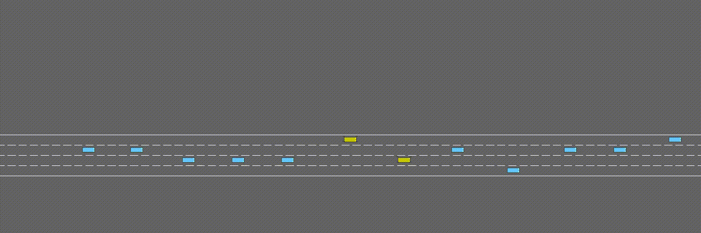
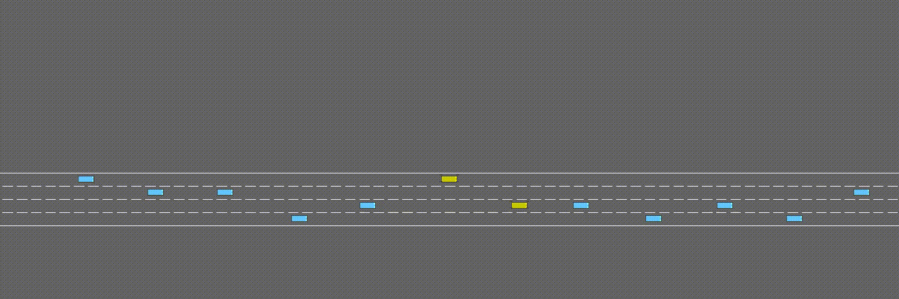
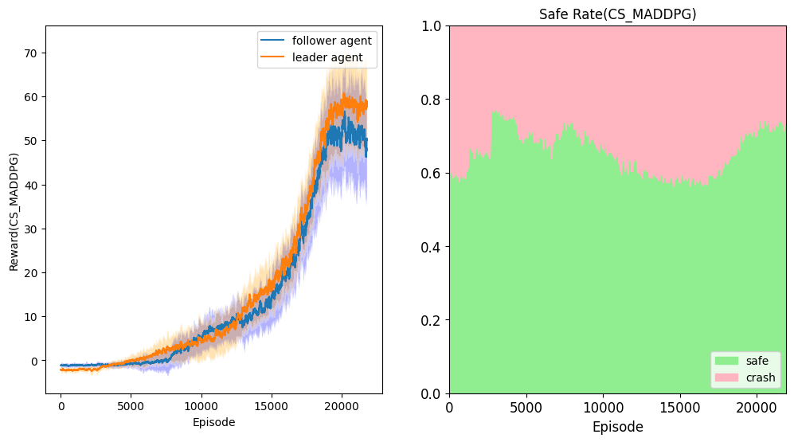

# Safe MARL in Autonomous Driving

This is a pytorch implementation of Constrained Stackelberg Q-learning(discrete action) and Constrained Stackelberg MADDPG(continuous action). These algorithms are proposed by incorporating the Stackelberg model into Deep Q-learning and MADDPG, and leveraging the Lagrangian multiplier method to deal with the safety constraints. The highway environments used in our experiments are modified from [highway-env](https://github.com/Farama-Foundation/HighwayEnv).

## 1. Installation

``` Bash
# create conda environment
conda create -n env_name python==3.9
conda activate env_name
pip install -r requirements.txt
```

## 2. Quick Start
- create experiment folder, for example, ./merge_env_result/exp2
- define train config in ./merge_env_result/exp2/config.py
- define env config in ./merge_env_result/exp2/env_config.py
- start training by running the following command
- new highway environment not supported yet due to version conflict

```shell
python main_bilevel.py --file-path ./merge_env_result/exp2
```

## 3. Demos
### 3.1 Safe Highway environment
<p align="center">
    
    
</p>

### 3.2 Safe Merge environment
<p align="center">
  
</p>

### 3.3 Safe Roundabout environment
<p align="center">
    
</p>

### 3.4 Safe Intersection environment
<p align="center">
    
</p>

### 3.5 Safe Racetrack environment
<p align="center">
    
</p>


## 4. Results
### 4.1 Safe Highway Environment
| Reward and Training curve                       | 
| ----------------------------------- | 
|  | 


### 4.2 Safe Merge Environment
| Leader reward                       | Follower reward                     | Total reward                        |
| ----------------------------------- | ----------------------------------- | ----------------------------------- |
|  |  ||

| Training curve                       | 
| ----------------------------------- | 
|  |


### 4.3 Safe Roundabout Environment
| Leader reward                       | Follower reward                     | Total reward                        |
| ----------------------------------- | ----------------------------------- | ----------------------------------- |
|  |  ||

| Training curve                       | 
| ----------------------------------- | 
| |

### 4.4 Safe Intersection Environment
| Leader reward                       | Follower reward                     | Total reward                        |
| ----------------------------------- | ----------------------------------- | ----------------------------------- |
|  |  ||

| Training curve                       | 
| ----------------------------------- | 
| |
### 4.5 Safe Racetrack Environment
| Leader reward                       | Follower reward                     | Total reward                        |
| ----------------------------------- | ----------------------------------- | ----------------------------------- |
|  |  ||

| Training curve                       | 
| ----------------------------------- | 
| |


